# 一零九面部表情检测系统

## 项目简介

一零九面部表情检测系统是一款基于人工智能技术的面部表情识别应用，能够实时检测和分析人脸表情，支持多种检测模式，包括摄像头实时检测、图片检测、批量图片检测和视频检测。

## 功能特性

- **摄像头实时检测**：实时从摄像头捕获画面并进行表情识别
- **图片检测**：上传单张图片进行表情分析
- **批量图片检测**：批量处理多张图片并保存结果
- **视频检测**：分析视频文件中的人脸表情
- **数据统计**：记录和统计检测数据，支持按日期和来源筛选
- **用户管理**：支持多用户登录，管理员可管理用户权限
- **系统设置**：可配置摄像头参数、检测设置等
- **音乐播放**：根据检测到的表情自动播放适合的音乐，支持播放控制和静音功能
- **表情强度分析**：分析表情的强度，分为强烈、明显、中等、轻微四个等级
- **多表情识别**：支持同时检测多个人脸的表情

## 系统要求

- Python 3.8+
- PyQt6
- OpenCV
- PyTorch
- NumPy
- PIL (Pillow)
- pygame (用于音乐播放)

## 安装说明

1. **克隆项目**

```bash
git clone https://github.com/YLJ109/AiFaceApp
cd AiFaceApp
```

1. **创建虚拟环境**

```bash
python -m venv venv
source venv/bin/activate  # Windows: venv\Scripts\activate
```

1. **安装依赖**

```bash
pip install -r App/requirements.txt
```

1. **运行应用**

```bash
python App/run.py
```

## 使用指南

### 登录系统

默认管理员账号：root
默认密码：123456

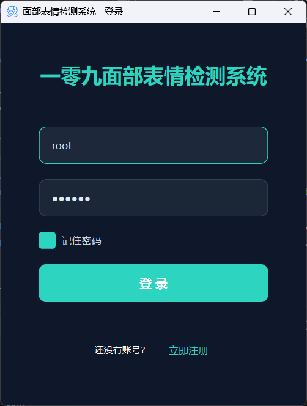

### 注册界面

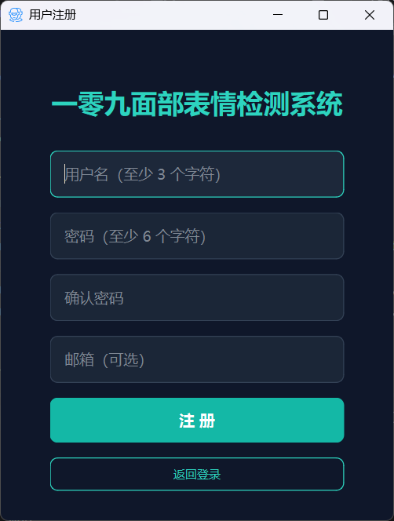

### 检测模式

#### 1. 摄像头检测

- 点击左侧导航栏的"摄像头检测"选项
- 系统会自动启动摄像头并开始实时检测
- 点击"拍照"按钮可保存当前检测结果
- 系统会根据检测到的表情自动播放适合的音乐

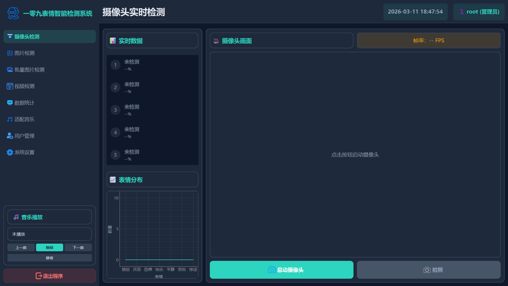

#### 2. 图片检测

- 点击左侧导航栏的"图片检测"选项
- 点击"选择图片"按钮上传图片
- 系统会自动分析图片中的人脸表情
- 点击"保存图片"按钮可保存检测结果

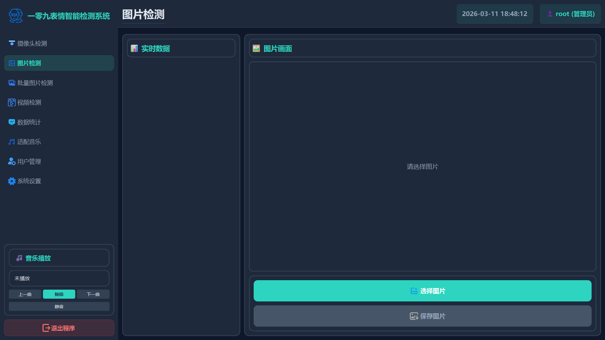

#### 3. 批量图片检测

- 点击左侧导航栏的"批量图片检测"选项
- 点击"选择图片"或"选择文件夹"按钮
- 选择保存目录
- 点击"开始检测"按钮开始批量处理

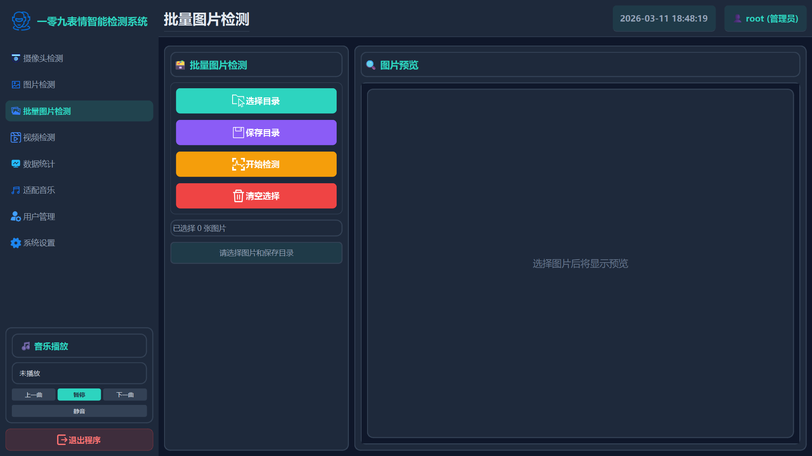

#### 4. 视频检测

- 点击左侧导航栏的"视频检测"选项
- 点击"选择视频"按钮上传视频文件
- 系统会播放视频并实时检测表情
- 点击"拍照"按钮可保存当前帧的检测结果

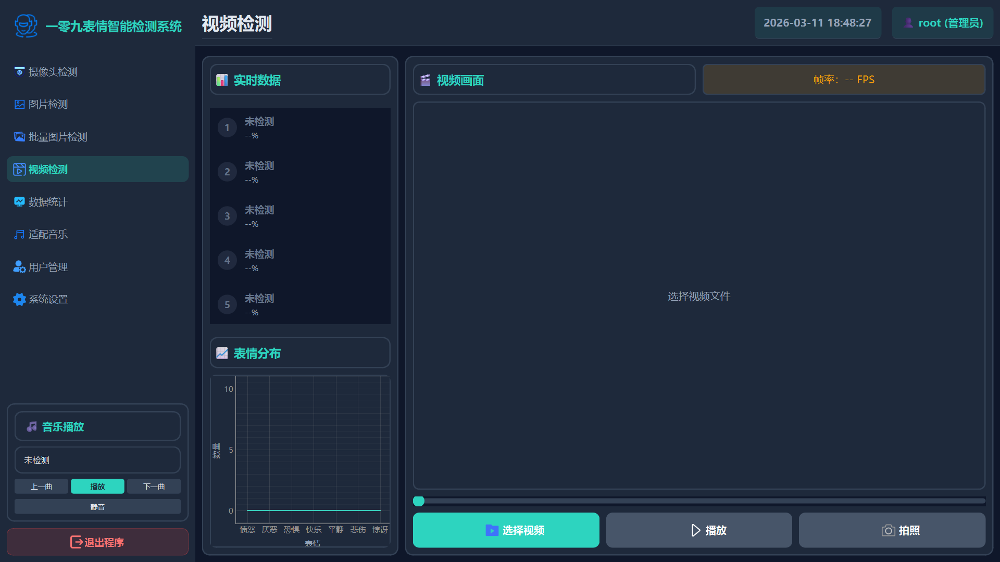

#### 5. 音乐播放

- 系统会根据检测到的表情自动播放适合的音乐
- 音乐播放器位于左侧导航栏底部，包含上一曲、播放/暂停、下一曲和静音按钮
- 当检测到新的表情时，音乐会自动切换
- 当表情不变时，音乐会循环播放
- 点击"静音"按钮可关闭声音

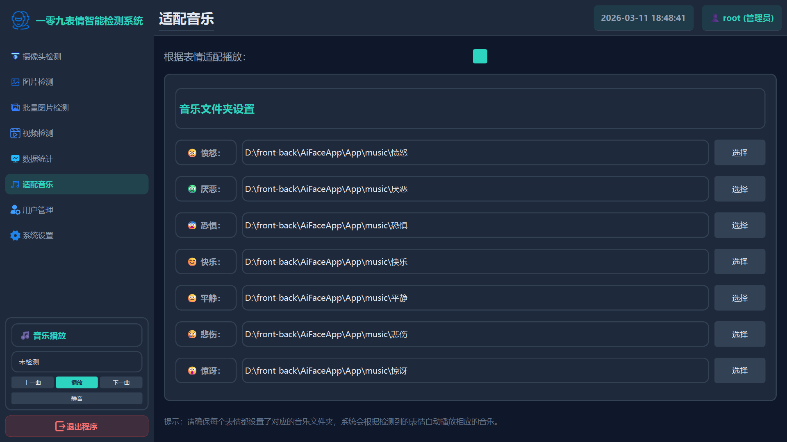

### 数据统计

- 点击左侧导航栏的"数据统计"选项
- 可按日期范围和来源筛选数据
- 查看检测统计信息和详细数据表格

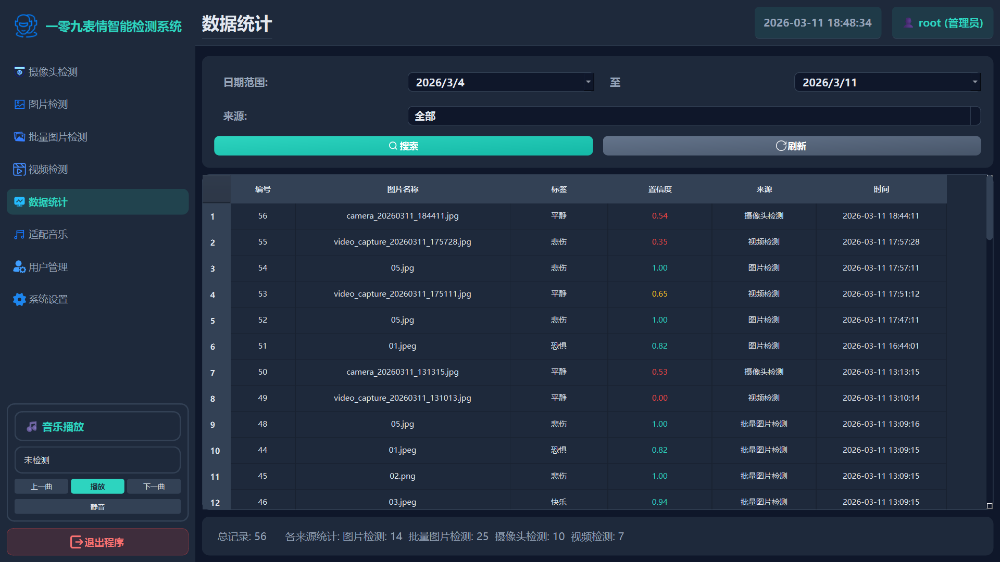

### 用户管理

- 管理员账号登录后，左侧导航栏会显示"用户管理"选项
- 可添加新用户、删除用户、修改用户权限
- 可将普通用户升级为管理员，或将管理员降级为普通用户

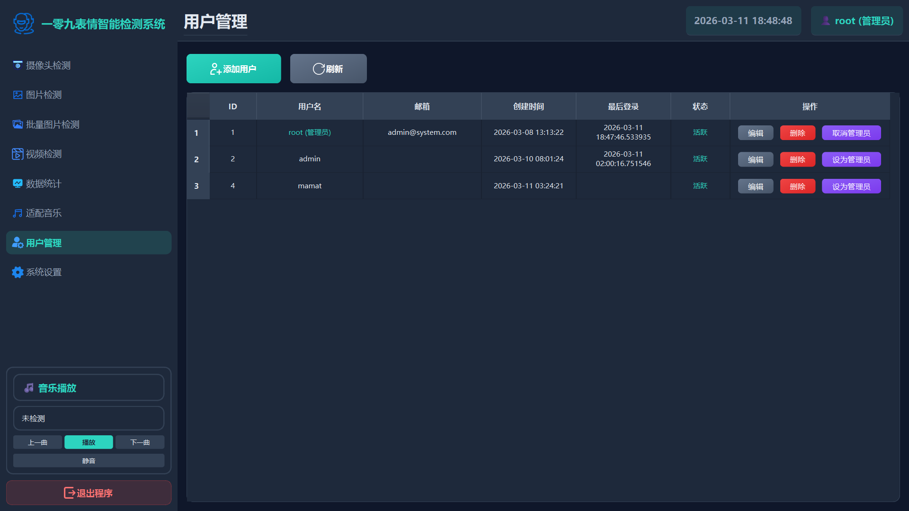

### 系统设置

- 点击左侧导航栏的"系统设置"选项
- 可配置摄像头参数、检测设置等
- 可设置音乐文件夹路径

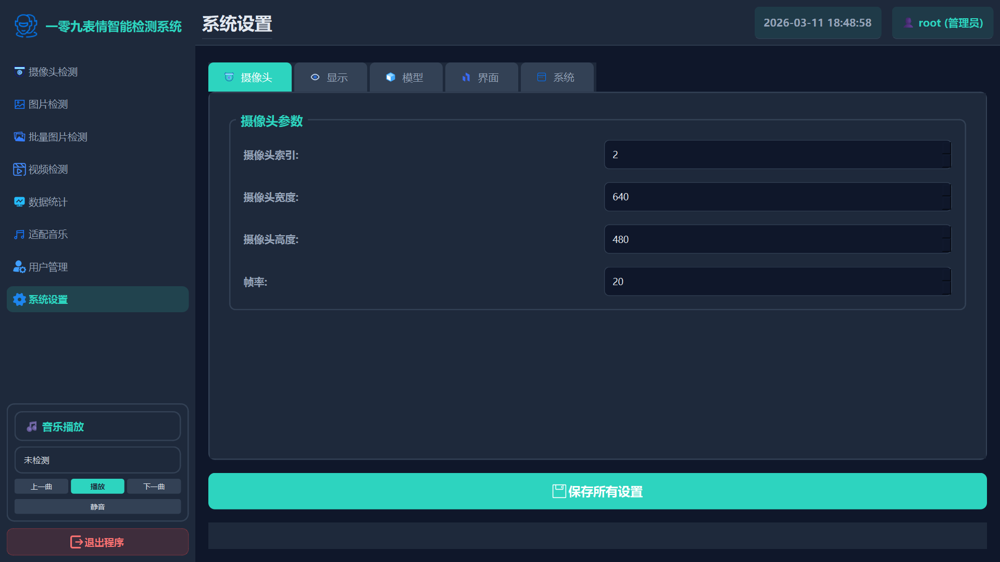

## 支持的表情

| 表情       | 中文 | 颜色 | 强度                       |
| -------- | -- | -- | ------------------------ |
| angry    | 愤怒 | 红色 | 🔥强烈 / 💡明显 / ⚡中等 / 💨轻微 |
| disgust  | 厌恶 | 橙色 | 🔥强烈 / 💡明显 / ⚡中等 / 💨轻微 |
| fear     | 恐惧 | 紫色 | 🔥强烈 / 💡明显 / ⚡中等 / 💨轻微 |
| happy    | 快乐 | 绿色 | 🔥强烈 / 💡明显 / ⚡中等 / 💨轻微 |
| neutral  | 平静 | 白色 | 🔥强烈 / 💡明显 / ⚡中等 / 💨轻微 |
| sad      | 悲伤 | 蓝色 | 🔥强烈 / 💡明显 / ⚡中等 / 💨轻微 |
| surprise | 惊讶 | 青色 | 🔥强烈 / 💡明显 / ⚡中等 / 💨轻微 |

### 表情图片

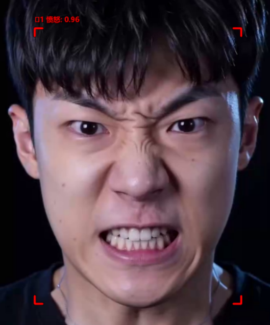 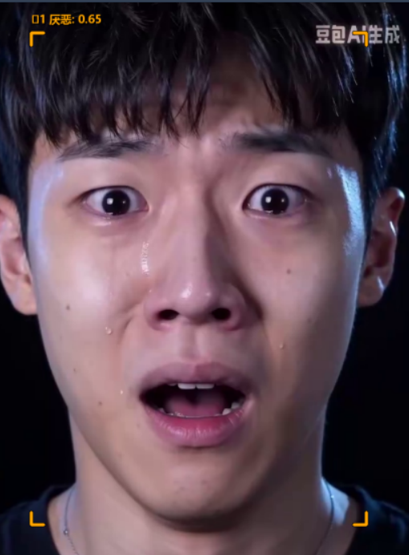 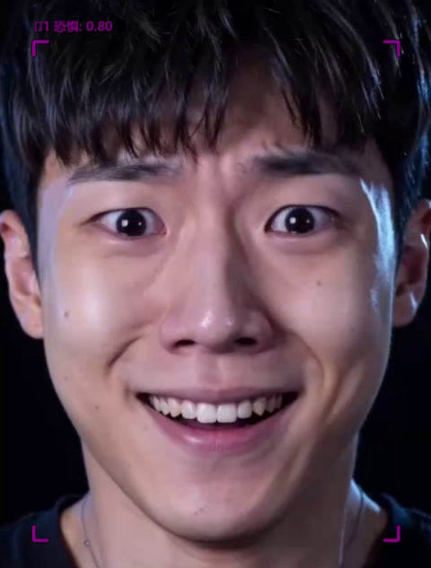

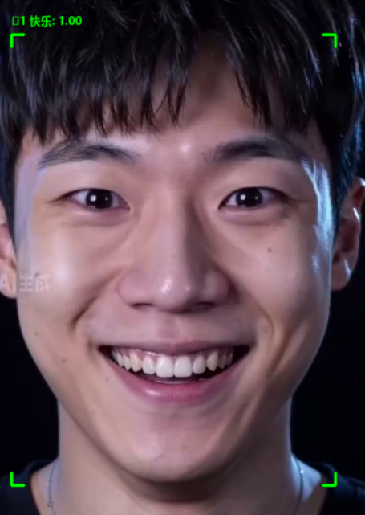 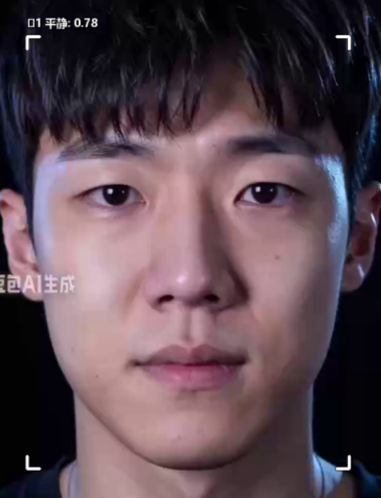   

## 核心算法

### 人脸检测算法

使用 OpenCV DNN 模块加载 Caffe 模型进行人脸检测，模型为 `res10_300x300_ssd_iter_140000_fp16.caffemodel`。

```python
def detect_faces(self, image):
    """检测人脸"""
    try:
        # 转换为blob
        blob = cv2.dnn.blobFromImage(
            cv2.resize(image, (300, 300)), 1.0, (300, 300),
            (104.0, 177.0, 123.0), False, False
        )
        
        # 前向传播
        self.net.setInput(blob)
        detections = self.net.forward()
        
        faces = []
        h, w = image.shape[:2]
        
        # 处理检测结果
        for i in range(detections.shape[2]):
            confidence = detections[0, 0, i, 2]
            if confidence > 0.5:
                box = detections[0, 0, i, 3:7] * np.array([w, h, w, h])
                (x, y, x2, y2) = box.astype('int')
                # 确保边界框在图像范围内
                x = max(0, x)
                y = max(0, y)
                x2 = min(w, x2)
                y2 = min(h, y2)
                w_box = x2 - x
                h_box = y2 - y
                if w_box > 0 and h_box > 0:
                    faces.append((x, y, w_box, h_box))
        
        # 限制最多检测5个人脸
        return faces[:self.max_faces]
    except Exception as e:
        print(f"人脸检测错误：{e}")
        return []
```

### 表情识别算法

使用 PyTorch 加载 MobileNetV2 模型进行表情识别，模型为 `pytorch_final_3060.pth`。

```python
def predict_emotion(self, face_image):
    """预测表情"""
    try:
        # 转换为PIL Image
        if isinstance(face_image, np.ndarray):
            face_pil = Image.fromarray(face_image)
        else:
            face_pil = face_image
        
        # 预处理
        face_tensor = self.transform(face_pil).unsqueeze(0).to(self.device)
        
        # 预测
        with torch.no_grad():
            outputs = self.model(face_tensor)
            probs = torch.nn.functional.softmax(outputs, dim=1)
            conf, pred = torch.max(probs, 1)
            emotion = EMOTION_CLASSES[pred.item()]
            confidence = conf.item()
        
        # 分析表情强度
        intensity = self.analyze_emotion_intensity(confidence)
        
        return emotion, confidence, intensity
    except Exception as e:
        print(f"预测错误：{e}")
        return 'neutral', 0.0, '轻微'
```

### 表情强度分析

根据模型预测的置信度分析表情强度：

```python
def analyze_emotion_intensity(self, confidence):
    """分析表情强度"""
    if confidence >= 0.8:
        return '强烈'
    elif confidence >= 0.6:
        return '明显'
    elif confidence >= 0.4:
        return '中等'
    else:
        return '轻微'
```

### 多表情识别

支持同时检测多个人脸的表情，并根据出现频率最高的表情播放音乐：

```python
def batch_predict_emotion(self, face_images):
    """批量预测表情"""
    try:
        if not face_images:
            return []
        
        # 预处理
        face_tensors = []
        for face_image in face_images:
            if isinstance(face_image, np.ndarray):
                face_pil = Image.fromarray(face_image)
            else:
                face_pil = face_image
            face_tensor = self.transform(face_pil)
            face_tensors.append(face_tensor)
        
        # 批量预测
        face_tensors = torch.stack(face_tensors).to(self.device)
        with torch.no_grad():
            outputs = self.model(face_tensors)
            probs = torch.nn.functional.softmax(outputs, dim=1)
            confs, preds = torch.max(probs, 1)
        
        # 处理结果
        results = []
        for i, (pred, conf) in enumerate(zip(preds, confs)):
            emotion = EMOTION_CLASSES[pred.item()]
            confidence = conf.item()
            intensity = self.analyze_emotion_intensity(confidence)
            results.append((emotion, confidence, intensity))
        
        return results
    except Exception as e:
        print(f"批量预测错误：{e}")
        return []
```

## 技术栈

- **前端**：PyQt6 (GUI界面)
- **后端**：Python
- **人脸检测**：OpenCV DNN (Caffe模型)
- **表情识别**：PyTorch (MobileNetV2模型)
- **数据库**：SQLite
- **图像处理**：OpenCV, PIL
- **音乐播放**：pygame
- **数据可视化**：pyqtgraph

## 项目结构

```
AiFaceApp/
├── App/
│   ├── InterFaceFunctionImage/ # 界面功能图片
│   ├── capture/          # 捕获的图片和视频
│   ├── code/             # 核心代码
│   │   ├── config.py     # 配置文件
│   │   ├── detection_core.py # 检测核心模块
│   │   ├── main.py       # 主程序入口
│   │   └── settings_manager.py # 设置管理
│   ├── config/           # 配置文件
│   ├── data/             # 数据文件
│   ├── database/         # 数据库
│   ├── icons/            # 图标资源
│   ├── models/           # 模型文件
│   │   ├── deploy.prototxt
│   │   ├── pytorch_final_3060.pth
│   │   └── res10_300x300_ssd_iter_140000_fp16.caffemodel
│   ├── temp/             # 临时文件
│   ├── views/            # 界面文件
│   │   ├── page/         # 页面组件
│   │   ├── batchImageDetection.py # 批量图片检测
│   │   ├── cameraDetection.py # 摄像头检测
│   │   ├── imageDetection.py # 图片检测
│   │   ├── settings.py   # 系统设置
│   │   ├── statistics.py # 数据统计
│   │   ├── userManagement.py # 用户管理
│   │   └── videoDetection.py # 视频检测
│   ├── __init__.py
│   ├── requirements.txt  # 依赖文件
│   └── run.py            # 主启动脚本
└── README.md             # 项目说明文档
```

## 模型说明

- **人脸检测模型**：res10_300x300_ssd_iter_140000_fp16.caffemodel
- **表情识别模型**：pytorch_final_3060.pth (基于MobileNetV2)
- **支持的表情**：愤怒、厌恶、恐惧、快乐、平静、悲伤、惊讶

## 模型训练

### 模型性能

表情识别模型在测试集上的表现：

```
📊 PyTorch 模型测试结果
============================================================

模型文件：pytorch_best_3060.pth
测试集大小：9955 张图像

总体准确率：0.8395 (83.95%)
平均 Loss: 0.4395

各类别准确率:
  angry       : 0.7568 (75%) - 1184 张
  disgust     : 0.9628 (96%) - 1184 张
  fear        : 0.7086 (70%) - 1184 张
  happy       : 0.9399 (93%) - 2279 张
  neutral     : 0.8028 (80%) - 1633 张
  sad         : 0.7429 (74%) - 1307 张
  surprise    : 0.8936 (89%) - 1184 张
```

### 模型准确率可视化

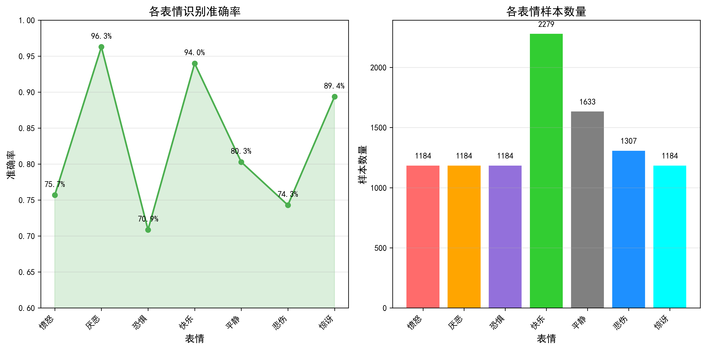

图表展示了各表情类别的识别准确率和样本数量分布，直观反映了模型在不同表情上的表现。

### 训练脚本

项目包含完整的模型训练脚本，位于 `7emotions_96x96_mobilenetv2_3060_train/scripts/` 目录：

#### 1. 数据划分脚本 (split_data.py)

用于将数据集划分为训练集和验证集：

```bash
cd 7emotions_96x96_mobilenetv2_3060_train/scripts
python split_data.py
```

功能：
- 自动将数据集按 80% 训练集、20% 验证集划分
- 支持自定义划分比例
- 确保每个表情类别都有足够的验证集样本

#### 2. 模型训练脚本 (train_pytorch_3060.py)

使用 PyTorch 训练表情识别模型，针对 RTX 3060 6G 优化：

```bash
cd 7emotions_96x96_mobilenetv2_3060_train/scripts
python train_pytorch_3060.py
```

特点：
- 使用 MobileNetV2 作为骨干网络
- 支持混合精度训练（AMP）
- 优化的批处理大小（Batch Size: 128）
- 学习率调度（CosineAnnealing）
- 早停机制防止过拟合
- 预计训练时间：25-35 分钟（50 epochs）

训练配置：
- 图像尺寸：96x96
- Batch Size：128
- 学习率：0.001
- 优化器：Adam + 权重衰减
- 数据增强：随机翻转、旋转、平移

#### 3. 实时检测脚本 (realtime_stable.py)

独立的实时摄像头表情检测脚本：

```bash
cd 7emotions_96x96_mobilenetv2_3060_train/scripts
python realtime_stable.py
```

功能：
- 实时摄像头检测
- 表情识别和置信度显示
- 表情缓冲和平滑处理
- FPS 显示
- 截图功能（按 's' 键）
- 退出功能（按 'q' 或 ESC 键）

### 数据集

数据集下载链接（百度网盘）：
- 链接：https://pan.quark.cn/s/5ab3be77a49c
- 密码：sfK2

数据集结构：
```
dataset/
├── train/
│   ├── angry/
│   ├── disgust/
│   ├── fear/
│   ├── happy/
│   ├── neutral/
│   ├── sad/
│   └── surprise/
└── val/
    ├── angry/
    ├── disgust/
    ├── fear/
    ├── happy/
    ├── neutral/
    ├── sad/
    └── surprise/
```

### 训练环境要求

- Python 3.8+
- PyTorch 1.10+
- CUDA 11.0+ (GPU 训练)
- 其他依赖：torchvision, tqdm, numpy, opencv-python

## 配置说明

配置文件位于 `App/config/app_config.json`，可修改以下参数：

- `CAMERA_INDEX`：摄像头索引
- `CAMERA_WIDTH`：摄像头宽度
- `CAMERA_HEIGHT`：摄像头高度
- `FRAME_RATE`：帧率
- `SHOW_BOX`：是否显示人脸框
- `SHOW_LABEL`：是否显示标签
- `ENABLE_DETECTION`：是否启用检测
- `APP_WIDTH`：应用窗口宽度
- `APP_HEIGHT`：应用窗口高度
- `ICON_PATH`：图标路径
- `USE_CUDA`：是否使用CUDA

## 性能优化

1. **模型量化**：在CPU上使用动态量化，减少模型大小和推理时间
2. **批处理预测**：实现了batch_predict_emotion方法，一次处理多个人脸，提高推理效率
3. **单例模式**：实现了DetectionCore的单例模式，确保模型只加载一次，避免重复加载
4. **多线程处理**：使用QThread在后台执行耗时操作，避免阻塞主线程
5. **内存管理**：在页面切换时停止摄像头、视频和批量图片检测，释放相关资源

## 错误处理

1. **异常捕获**：在关键方法中添加了try-except块，捕获并处理异常
2. **错误提示**：在遇到错误时显示友好的错误提示，而不是直接崩溃
3. **资源管理**：确保在出现错误时也能正确释放资源
4. **KeyboardInterrupt处理**：在用户按下Ctrl+C时，程序能够优雅退出

## 许可证

本项目仅供学习和研究使用。

## 联系方式

如有问题或建议，请联系项目维护者。